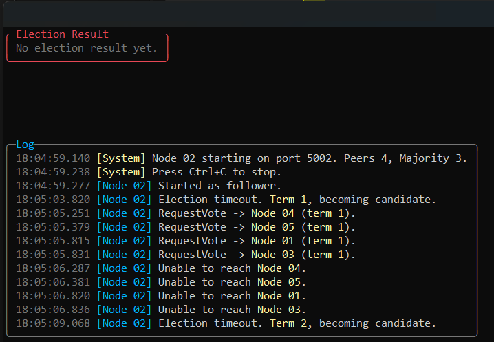
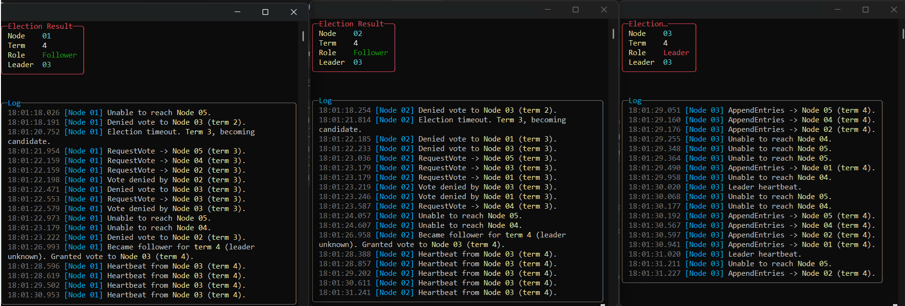
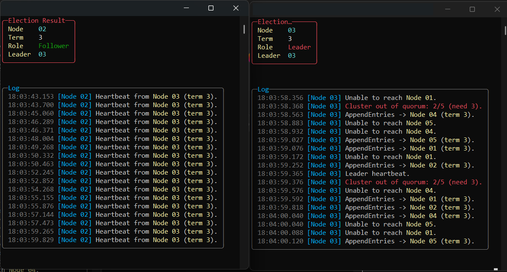

# RaftSimulator

RaftSimulator is a small raft election simulator with HTTP-based node-to-node RPC.
It focuses on leader election and heartbeat stability for local testing scenarios.

> ⚠️ Disclaimer  
> This is not a production-ready implementation of the Raft algorithm.  
> The project was created purely for educational and demonstration purposes to help illustrate the core concepts and mechanics of Raft consensus.


## How it works
1. Each node hosts HTTP endpoints for request-vote and append-entries RPC.
2. Nodes start as followers and trigger elections when the timeout elapses.
3. Candidates request votes from peers and become leader on majority.
4. Leaders send heartbeats to keep followers stable.
5. Status snapshots are available via `/raft/status`.

## Configuration (`appsettings.json`)
All options live under the `Raft` section.

- `NodeId` (`int`, required): Node identifier.
- `Port` (`int`, required): Local HTTP port.
- `Peers` (`string`, required): Semicolon-delimited list of peers in `id=http://host:port` format.
- `HeartbeatSeconds` (`int`, optional): Heartbeat interval; default `1`.
- `MinElectionSeconds` (`int`, optional): Minimum election timeout; default `4`.
- `MaxElectionSeconds` (`int`, optional): Maximum election timeout; default `7`.
- `MinNetworkDelaySeconds` (`int`, optional): Minimum simulated network delay; default `1`.
- `MaxNetworkDelaySeconds` (`int`, optional): Maximum simulated network delay; default `2`.

## Example configuration
```json
{
  "Raft": {
    "NodeId": 1,
    "Port": 5001,
    "Peers": "1=http://localhost:5001;2=http://localhost:5002;3=http://localhost:5003;4=http://localhost:5004;5=http://localhost:5005",
    "HeartbeatSeconds": 1,
    "MinElectionSeconds": 4,
    "MaxElectionSeconds": 7,
    "MinNetworkDelaySeconds": 1,
    "MaxNetworkDelaySeconds": 2
  }
}
```


## Screenshots
Start screen before elections begin:



Election results with leader and followers:



Out of quorum (only one leader and one follower; minimum three nodes required):



